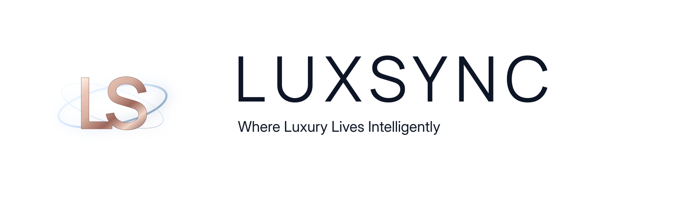

# LuxSync LLC Logo Usage Standard

<p align="center">
  
</p>

**Status:** Active / Authoritative  
**Company:** LuxSync LLC  
**Official slogan:** Where Luxury Lives Intelligently

## Approved Logo Family

### 1. Orb initials logo

Use the protected `LS` monogram artwork for square, compact, emblem, avatar, favicon-source, decorative, and orbital placements.

Required characteristics:

- Interlocked `LS` letterforms in the approved high-contrast Didone/Bodoni-style serif artwork
- Exact approved luminous orbital structure behind and around the initials
- Metallic blush/rose/champagne treatment derived from the Plush Drift palette
- Icy light-blue orbit treatment derived from Dusty Steel
- Approved sparkle and peak-shine accents
- Transparent background where the placement requires isolation

Do not redraw, simplify, flatten, recolor, change letterforms, substitute a font, or invent a new orbit.

### 2. Horizontal logo with slogan

Use the protected horizontal lockup for headers, documentation covers, banners, wide placements, footer branding, presentation title areas, and other horizontal placements.

Required characteristics:

- `LUXSYNC` in the approved matching Didone/Bodoni-style logo lettering
- Official slogan: **Where Luxury Lives Intelligently**
- Matching metallic blush/rose/champagne treatment
- Approved sparkle/peak-shine highlights and line work
- Slogan lighting may use the approved icy light-blue accent
- No orbital fragment from the initials logo may appear in a standalone horizontal lockup

### 3. Combined signature treatment

When both marks appear together, use a deliberate separator with restrained sparkle/highlight accents. The separator must remain within the Plush Drift palette and must not introduce lavender, purple, orange-copper, or unrelated neon colors.

## Color Discipline

Authoritative base palette:

- Slate Navy `#0D1526`
- Dark Suede `#172036`
- Pale Driftwood `#D0BEB0`
- Warm Taupe Mauve `#9E8B85`
- Antique Rose Taupe `#967878`
- Dusty Steel `#7B96B2`

Metallic and glow treatments are derived effects, not replacement brand colors.

- Rose metal: cooler blush/champagne/antique-rose family
- Orbit glow: icy Dusty Steel-derived blue
- Sparkle peaks: pearl/ivory, blush, or icy blue as appropriate
- Avoid lavender/violet unless a future authoritative palette explicitly adds it
- Avoid orange/copper drift that makes the metal read outside Plush Drift

## Typography Boundary

The Didone/Bodoni-style lettering is reserved for protected LuxSync logo artwork only.

All editable/live text uses:

- **Manrope 500/600** for headings, display, navigation, CTAs, and graphic UI
- **Inter 400/500** for body copy, supporting text, forms, controls, and captions

## Documentation Rule

Durable LuxSync LLC documentation is branded collateral, including Markdown.

Every new durable document should, where the format supports it:

1. Include an approved LuxSync logo/lockup near the beginning.
2. Identify **LuxSync LLC** in the header or footer.
3. Use the official slogan where a branded subtitle/footer is appropriate.
4. Preserve Manrope + Inter for editable text.
5. Use only approved Plush Drift colors and derived effects.
6. Reference protected logo files rather than rebuilding the logo in live text.

This applies to Markdown, PDFs, presentations, runbooks, architecture documents, decision records, guides, prompts intended for durable reuse, and branded exports.

## Source Files

Canonical logo assets live under:

```text
brand/assets/01-brand/
```

The approved source artwork must be preserved separately from generated derivatives. Automated generation or normalization must not overwrite protected logo files.

## Change Control

Any change to logo letterforms, orbit geometry, metallic treatment, slogan wording, sparkle/highlight treatment, or logo color balance requires explicit approval and an update to this standard in the same change set.

---

<p align="center"><strong>LuxSync LLC</strong><br><em>Where Luxury Lives Intelligently</em></p>
