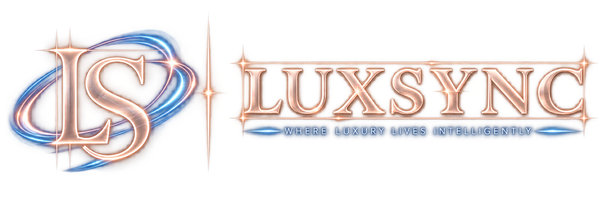

  

<strong>Where Luxury Lives Intelligently</strong>

---

# Sheldon Bardol

## Co-Founder & Chief Customer and Operations Officer

**LuxSync LLC**
**Leadership profile:** Approved for website and company materials
**Brand system:** LuxSync Production Raster v5
**Voice:** Intelligent Calm

## Website Biography

Sheldon Bardol is the Co-Founder and customer and operations leader of LuxSync, helping transform the company's intelligent-living vision into practical, customer-ready experiences.

Drawing on his background in financial operations, collections, customer resolution, and relationship management, Sheldon brings a grounded, solutions-oriented perspective to the business. His strengths in outreach, follow-through, and finding workable paths forward help LuxSync build trust with customers, suppliers, and business partners.

As Chief Customer and Operations Officer, Sheldon leads supplier and distributor relationships, product curation, customer engagement, community development, marketing initiatives, and brand storytelling. He also supports business-development outreach to short-term rental operators, property managers, and other customers seeking smart technology without unnecessary complexity.

Sheldon's focus is ensuring that every LuxSync recommendation balances compatibility, usefulness, aesthetics, and value. His operational leadership helps make the LuxSync experience feel personal, dependable, and refreshingly simple.

## Compact Biography

Sheldon Bardol is the Co-Founder and Chief Customer and Operations Officer of LuxSync. With a practical background in financial operations, customer resolution, and relationship management, he leads product curation, supplier partnerships, customer engagement, and operational execution. His focus is creating a LuxSync experience that feels personal, dependable, and simple from the first recommendation through every customer interaction.

## Brand Presentation

- Use the protected LuxSync logo artwork without redrawing, retyping, recoloring, or regenerating it.
- Set headings and title treatments in Manrope 500/600.
- Set biography and supporting copy in Inter 400/500.
- Use only the approved LuxSync Production Raster v5 palette for branded text, rules, backgrounds, and accents.
- Champagne Rose Gold Metallic may be used as a restrained premium accent with `#D6B0A0` as its anchor.
- Keep the presentation spacious, refined, warm, and confident.

---

<em>Where Luxury Lives Intelligently</em>

